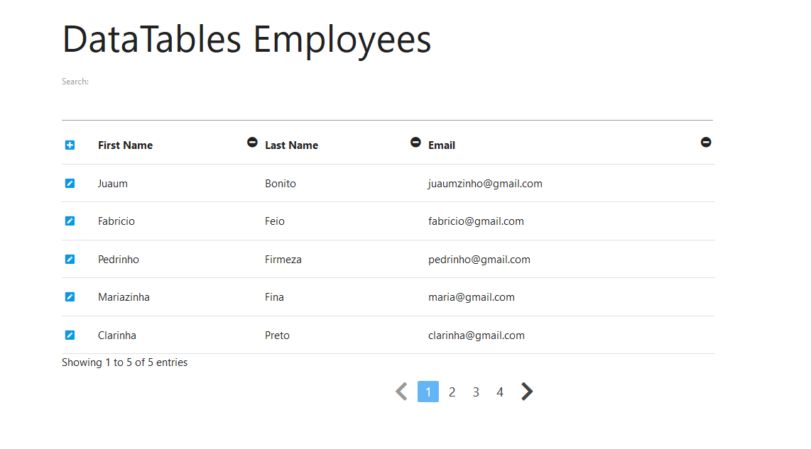

# SpringBoot + SpringData + Thymeleaf + DataTables

This is just a sandbox project to mess around with those technologies, 
it has CRUD operations, custom SpringData methods, DataTables to order,filter and
other tables related functionaries and it uses Thymeleaf to render.

Also this project is using Materialise CSS to make it beautiful.

Feel free to take a look and play with it.

#### Home

#### Edit

## Build With

* [Java](https://www.oracle.com/technetwork/pt/java/javase/downloads/jdk8-downloads-2133151.html) - 8
* [Hibernate ORM](http://hibernate.org/orm/) - 5.3.10.Final
* [H2 Database](https://www.h2database.com/html/main.html) - 1.4
* [SpringBoot](https://spring.io/) - 2.1.8.RELEASE
* [Thymeleaf](https://www.thymeleaf.org/) - 3.0.11.RELEASE
* [DataTables](https://datatables.net/) - 1.10.19
* [Materialize CSS](https://materializecss.com/) - 1.0.0